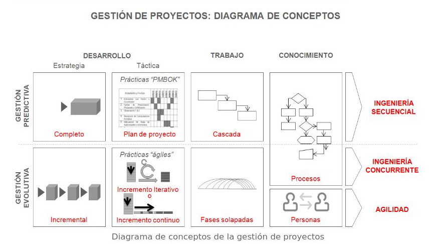

# Conceptos de Gestión de Proyectos

>Las diferentes prácticas y metodologías responden a combinaciones de tres conceptos y dos patrones de gestión de proyectos.

Desde los 80 se han desarrollado tantos modelos de procesos, marcos y prácticas de trabajo para mejorar la calidad y eficiencia en los proyectos de software, que resulta útil llegar a la base de los principios que subyacen, y las estrategias con las que los desarrollan; de forma que usando como coordenadas tres conceptos: “desarrollo, trabajo y conocimiento”, y dos modelos de gestión: “predictiva y evolutiva” se despeja y simplifica el aparente laberinto de modelos de procesos, marcos o prácticas de trabajo a los que nos referimos.

