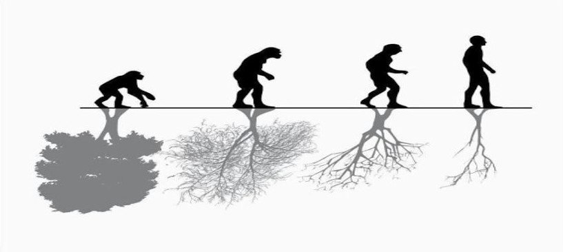
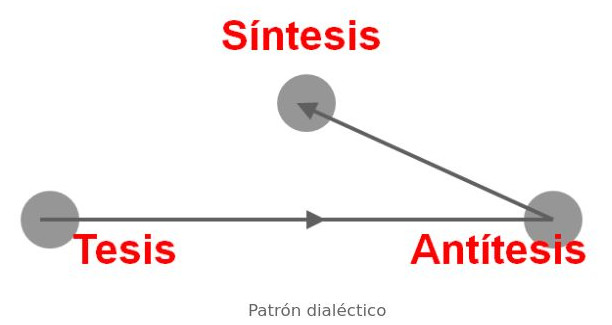
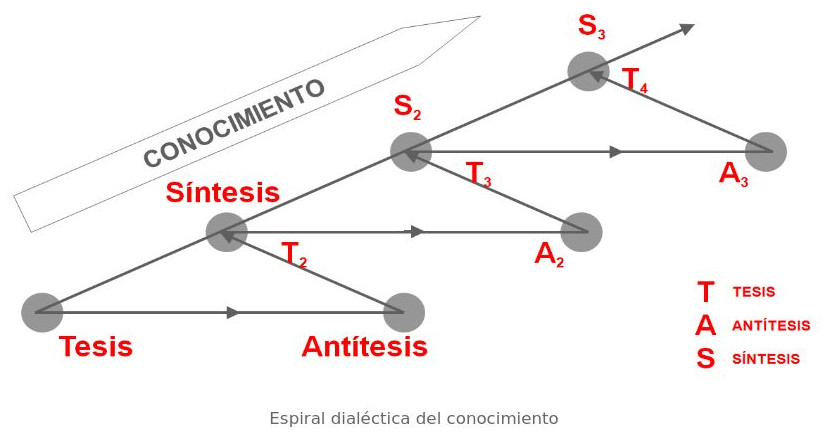

# Conocimiento en Continua Evolución

Los marcos de prácticas ágiles no llegan a los proyectos “TIC" (Tecnologías de la Información y la Comunicación) como **tesis** de conocimiento, sino como **antítesis** al que la Ingeniería del Software venía desarrollando.

Comenzaremos viendo qué significa esto, y así tomar la distancia necesaria para ver con perspectiva las razones por las que los proyectos TIC abrazaron la agilidad a finales del siglo pasado, y sus diferencias con la ingeniería de procesos; no desde las prácticas concretas, sino desde los principios en los que se basan, y con ello comprender las fortalezas y debilidades de la agilidad.

Alcanzar una visión de las razones y los principios de cada metodología, más allá de la concreción de un modelo es clave para dar el salto de gestión
técnica a gestión experta. Esto es, de gestión basada en la aplicación de prácticas a gestión basada en la aplicación del propio conocimiento:

- **Gestión técnica:** Basada en la aplicación de modelos de prácticas y procesos.
- **Gestión experta:** Basada en el conocimiento tácito del gestor.

## El Patrón Dialéctico

Al cuestionar el conocimiento, se inicia su evolución, que sigue un patrón dialéctico de:

- Tesis.
- Antítesis.
- Síntesis.

De manera esquemática el patrón dialéctico puede definirse como el ritmo de avance que contrapone una antítesis a una concepción previa, entendida como tesis. La antítesis muestra los problemas y contradicciones de la tesis, y de la confrontación surge un tercer momento llamado síntesis, una resolución o una nueva comprensión del problema.

De esta forma la estrategia de abordar con ingeniería de procesos los retos de los proyectos de software, supuso la primera tesis para dar respuesta a la “crisis del software”; y sus problemas y contradicciones han sido puestos de manifiesto por su antítesis: **la agilidad**.

En 1968, en la primera conferencia sobre desarrollo de software celebrada por la organización OTAN, se analizaron los problemas de la programación del software, y en ella se acuñó el término “crisis del software” para referirse a ellos.

La conclusión de la conferencia fue la necesidad de crear una disciplina científica que, como ocurría en otras áreas, permitiera aplicar un enfoque
sistemático disciplinado y cuantificable al desarrollo, operación y mantenimiento de los sistemas del software, es decir, la aplicación de la ingeniería de procesos al software. Fue el nacimiento de la Ingeniería del Software.

La primera estrategia de la Ingeniería del software (tesis) se ha basado en dos pilares:

- **Ingeniería de procesos**
- **Gestión predictiva**

El primero para aplicar el principio básico de calidad contrastado con éxito en los entornos de producción industrial: “la calidad del resultado depende de la calidad de los procesos empleados”. El segundo para garantizar el cumplimiento de agendas y presupuestos.

Mientras esta disciplina evolucionaba y se perfeccionaba a través de diferentes modelos de procesos y cuerpos de conocimiento para gestión de
proyectos (MIL-Q9858, ISO9000, ISO9000-3, ISO 12207, SPICE, SW-CMM...) en la industria del software surgían dudas y se cuestionaba esta estrategia.

>¿La planificación predictiva es apropiada para cualquier proyecto? ¿Los criterios de éxito son siempre el cumplimiento de fechas, costes y funcionalidades preestablecidas?

Empiezan a surgir proyectos cuya finalidad no es construir un sistema previamente definido y planificado en su totalidad, y para los que no es realista trazar un plan cerrado desde el inicio.

Proyectos en los que no interesa saber si el sistema final tendrá 20 o 200 funcionalidades, ni conocer cómo serán éstas en detalle: Su interés es poner una novedad en el mercado lo antes posible, y desde ese momento evolucionar la visión y valor de forma continua.

Por otra parte también se cuestiona si el software se puede producir con patrones de procesos industriales, y se empieza a aceptar que en la calidad del resultado puede ser más importante el conocimiento tácito de la persona que lo realiza que el know-how aportado a través del proceso y la tecnología empleada.

Desde los orígenes de la agilidad, a mediados de los 90, hasta 2005-2010 han sido habituales las posturas radicales entre los defensores de los modelos de procesos y de los marcos ágiles, posiblemente más enfocados en descalificar al otro que en revisar y depurar los propios métodos.

La evaluación de un defensor de modelos de procesos depende más de una buena presentación en papel que de la calidad real del producto de software.
Tiene que ver más con el seguimiento a ciegas de una metodología que con el desarrollo y puesta en producción de un sistema en el panorama tecnológico.

## Espiral Dialéctica del Conocimiento

El conocimiento profesional evoluciona de forma continua porque la realidad en la que se aplica está en permanente movimiento, y también porque la mejora siempre es posible.

La puesta en funcionamiento de nuevas técnicas, procesos o modelos genera sus propias antítesis al revelarse las debilidades, contradicciones y puntos de mejora, y el enfrentamiento de ambos conduce hacia una síntesis, que pasará a ser una nueva tesis, cuyo posterior uso producirá su antítesis, desarrollando a través de este patrón dialéctico una espiral de evolución continua del conocimiento.

>En disciplinas no técnicas y en generaciones anteriores el ritmo de avance sobre esta espiral dialéctica permitía a los profesionales desempeñarse con los conocimientos adquiridos en su licenciatura durante toda su carrera profesional. Sin embargo hoy esto no es posible, en especial, en el sector TIC.

No hay métodos, prácticas o modelos de trabajo que nos ayuden con solvencia durante mucho tiempo, sino conocimiento en evolución. Esta es una consideración clave y la razón por la que no define un modelo fijo, sino un conocimiento actualizado como base para una gestión más experta que técnica. Más basada en el criterio documentado y experto del gestor que en la aplicación de prácticas o procesos.
